# Weights & Biases with run:ai
  
**A 15-minute video of a live demo can be found [here](https://youtu.be/30WjMOZ0hA8)**
  
  
## Description:  

This repo details an example of how to integrate Weights & Biases with run:ai.  
There are 3 basic steps

1. Create a docker image with wandb package installed  
2. Create a persistent netrc file by using the "wandb login" command; copy the generated netrc file to the NFS  
3. Mount the persistent netrc file in the image, when we submit run:ai jobs  
  
The docker image used is public and can be found here:  
[jonathancosme/base-root-wandb-tf](https://hub.docker.com/r/jonathancosme/base-root-wandb-tf)  
The files used to create the image can be found here: [/base-root-wandb-tf](./base-root-wandb-tf).  
  
The notebook and python scripts can be found here: [/wandb_demo](./wandb_demo).

The CLI command can be found here: [/cli_command.txt](./cli_command.txt).  
  
Slides and PDFs for the presentation can be founc here: [/docs](./docs).  
  
You can register with W&B at [wandb.ai](https://wandb.ai)   
Documentation for W&B can be found at [docs.wandb.ai](https://docs.wandb.ai)  
  
## Weights & Biases background
  
### How does W&B work?  

Python scripts (with wandb code) are run within an environment (or image) that has the wandb package installed.  
  
Experiments information is sent to wandb.ai web account.*  
  
You can view all experiment information on the wandb.ai web account.*  
  
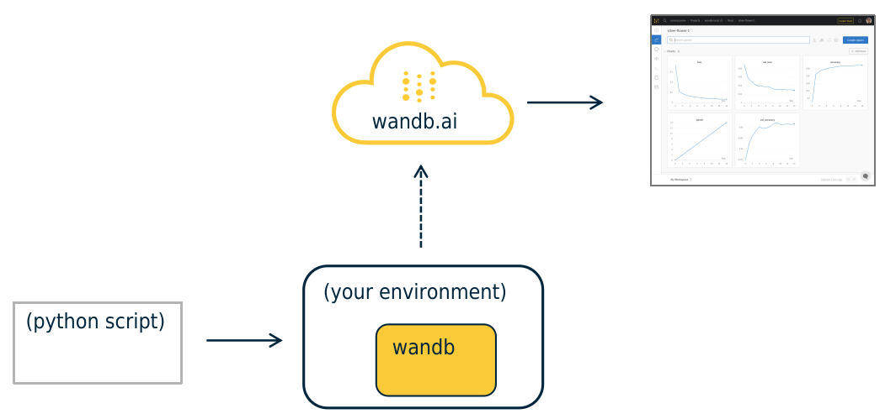  

*Note that W&B **does** offer "on-prem" solutions, that do not require a wandb.ai web account (and all information is kept on your chosen storage device)  

### What is needed for W&B to run?  
  
1. An account with W&B  
2. The "wandb" package installed  
3. A "netrc" file (created by running "wandb login" command)  
4. wandb code within your python script
  
#### Step 1: Create account with W&B
  
Navigate to [wandb.ai](https://wandb.ai) and select "Sign Up"  
  
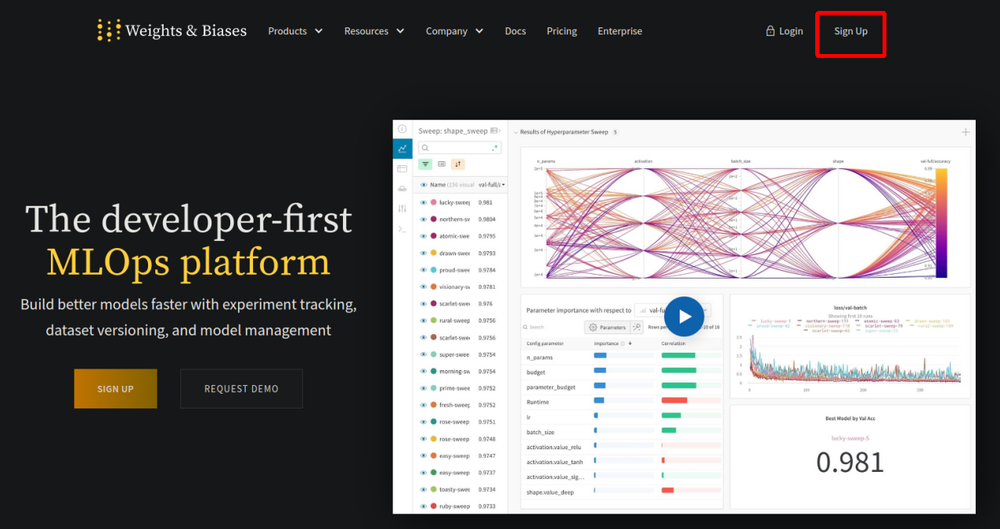  

Follow steps to register  
  
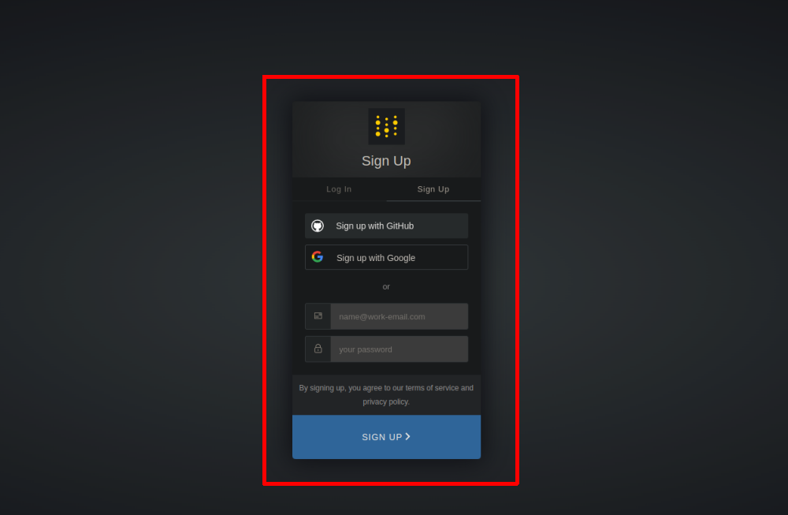  
  
After registering, click on the W&B icon on the top left.  
You'll notice an API key.  
This will be used in step 3.  
  
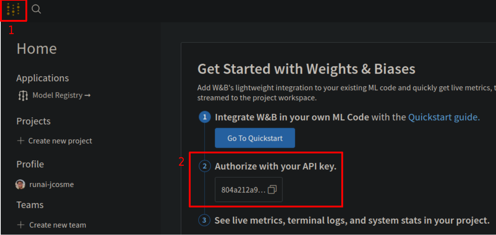  
  
#### Step 2: Install "wandb" package  
  
We can install wandb using conda.  
  
Here is an example command where we create an environment called "wandb-env" and install the "wandb" package (along with Tensorflow):  
  
~~~bash
mamba create -n wandb-env -c conda-forge wandb tensorflow tensorflow-gpu -y
~~~  
  
#### Step 3: netrc file  
  
The .netrc file is crated after running "wandb login" command.  
  
The .netrc file is always **created** in the **home** directory **(\~/.netrc)**  
  
When running wandb within your code, it will always **look** for the .netrc file in the home directory **(\~/.netrc)**  
  
For example, let's I run the command locally, on my personal desktop:  
~~~bash
wandb login
~~~  
  
Copy the API key from my W&B account... 
  
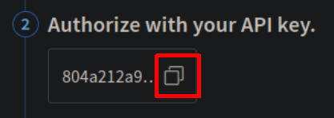  
  
...then paste it inot the terminal (and hit enter)  
  
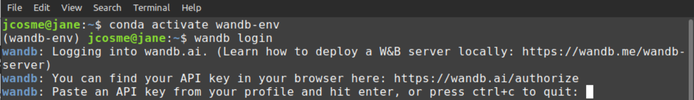  
  
A file will be created in my home directory (/home/jcosme)  
  
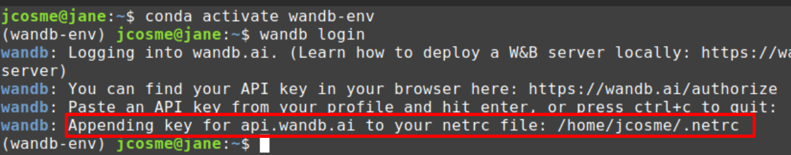  
  
The .netrc file is a text file containing your API key  
  
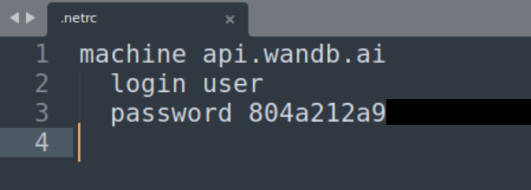  
  
The wandb package references this file in order to interface with your wandb.ai web account.  
You will no longer need to trun the "wandb login" command once the .netrc file is created.  
  
#### Step 4: wandb code in your script  
  
Here are the highlights of the wandb code within our python script:  
  
~~~python
import wandb
from wandb.keras import WandbCallback
from tensorflow import keras
from tensorflow.keras import layers

wandb.init(project="wandb-local")

wandb.config = {
  "learning_rate": 0.001,
  "epochs": 15,
  "batch_size": 128
}

# (load data here)
# (build model)

opt = keras.optimizers.Adam(
    learning_rate=wandb.config['learning_rate']
)

model.compile(
    loss="categorical_crossentropy", 
    optimizer=opt, 
    metrics=["accuracy"]
)

model.fit(
    x_train,
    y_train, 
    validation_split=0.1, 
    batch_size=wandb.config['batch_size'],
    epochs=wandb.config['epochs'],
    callbacks=[WandbCallback()],   
)
~~~  
  
For more information on how to use wandb code in your scripts, visit [docs.wandb.ai](https://docs.wandb.ai)  
  
## Setting up W&B with run:ai
  
### What is needed for run:ai to work with W&B?  
  
Steps 1 & 4 remain the same.  
There is a small difference with steps 2 & 3.  
  
2. A **docker iamge** with **wandb** installed
3. A **persistent netrc** file

### Step 2: Docker image with wandb installed
  
The docker image we will be using is publicly availble here:  
[jonathancosme/base-root-wandb-tf](https://hub.docker.com/r/jonathancosme/base-root-wandb-tf)*  
The files used to create the image can be found here: [/base-root-wandb-tf](./base-root-wandb-tf).  
  
This is the dockerfile
  
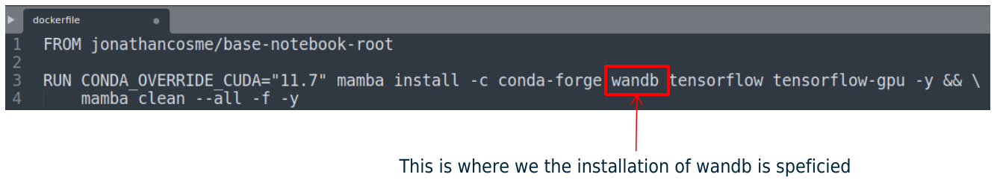  
  
*This image uses “jonathancosme/base-notebook-root” as a base image, which is a slight modification of the official “jupyter/base-notebook” image. 
More information can be found here: [github.com/jonathancosme/jupyter-base-notebook-root](https://github.com/jonathancosme/jupyter-base-notebook-root)  
  
### Step 3: Persistent netrc file
  
#### About wandb login command:
  
The home directory in our image is:  
**/home/jovyan**  
  
(before we run wandb login)  
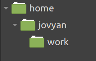  
  
Therefore, the .netrc file will be created as:  
**/home/jovyan/.netrc**  
  
(after we run wandb login)  
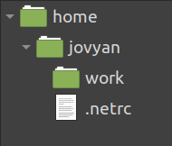  
  
We want to **create a persistent copy of the netrc file** on our NFS...  
... so that we can mount hat file in our image, when we run jobs.  
  
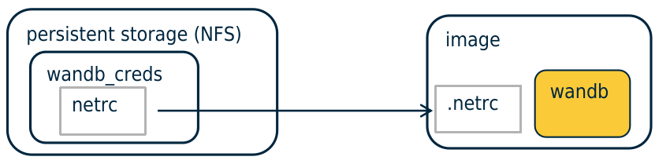  
  
In our example, the NFS-to-image mapping would look like this:  
  
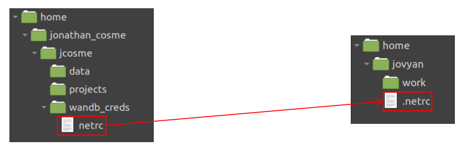  
  
#### How do we create a persistent netrc file?  
  
1. mount our NFS to the jupyter work directory  
  
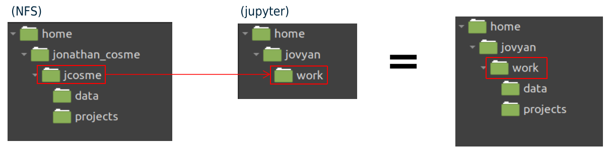  
  
2. Create the wandb_creds folder in the mounted directory  
  
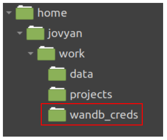  
  
3. Create the .netrc file (with wandb login command)  
  
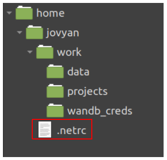  
  
4. Copy .netrc file to created wandb_creds folder  
  
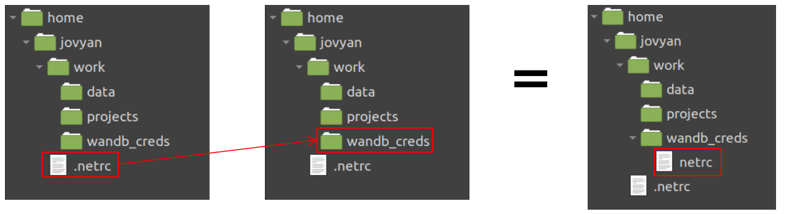  
  
#### run:ai UI walkthrough  
  
On the UI, create a new interactive job with the image:  
**jonathancosme/base-root-wandb-tf**  
Make sure the Jupyter Notebook flag is toggled
  
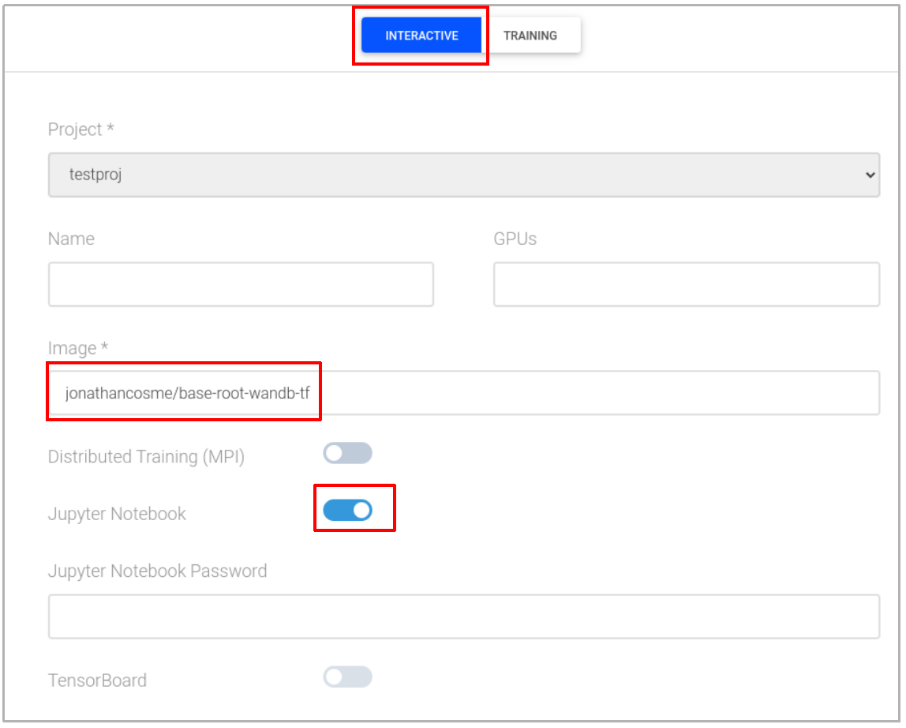  
  
mount your NFS (/home/jonathan_cosme/jcosme in our example), to the jupyter work directory (/home/jovyan/work):  
  
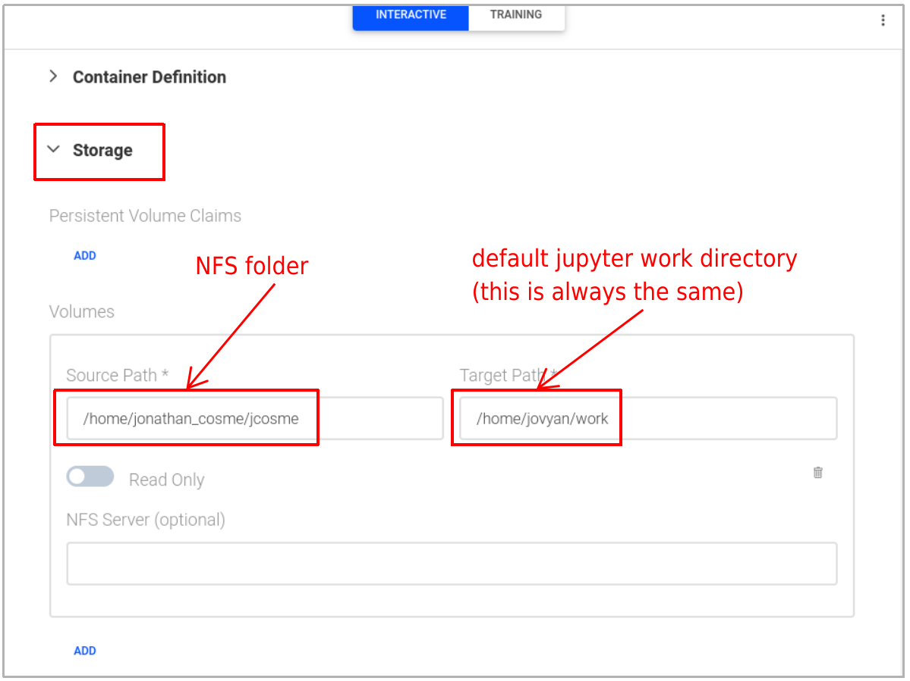  
  
**NOTE** this image does take a while to start up.  
  
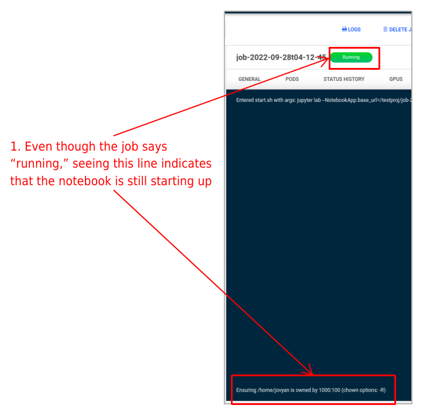  
  
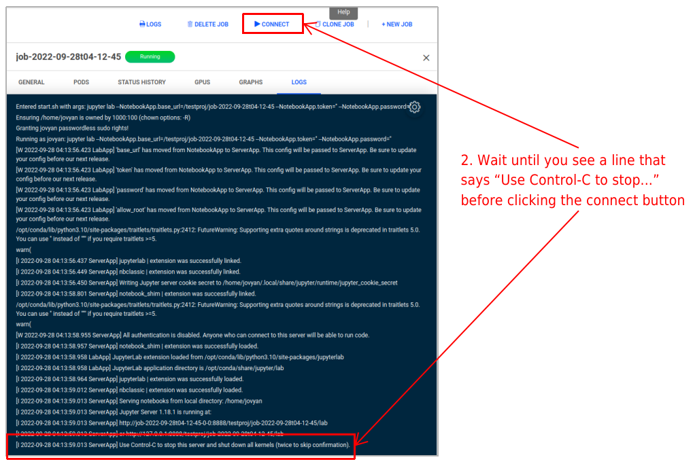  
  
After connecting, we should see all our NFS files and folders within the work directory:  
  
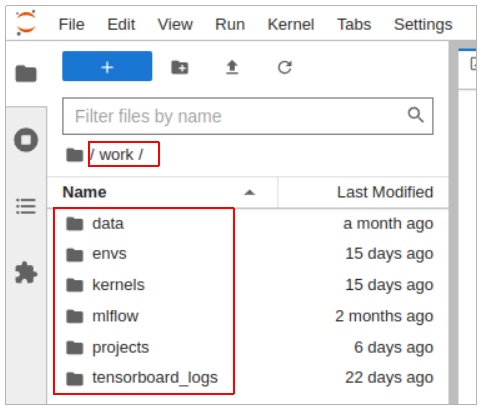  
  
Within the work directory, create a new folder called "wandb_creds"  
  
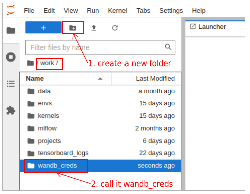  

run "wandb login" command to make .netrc file  
~~~bash
wandb login
~~~  
~~~bash
exit
~~~  
  
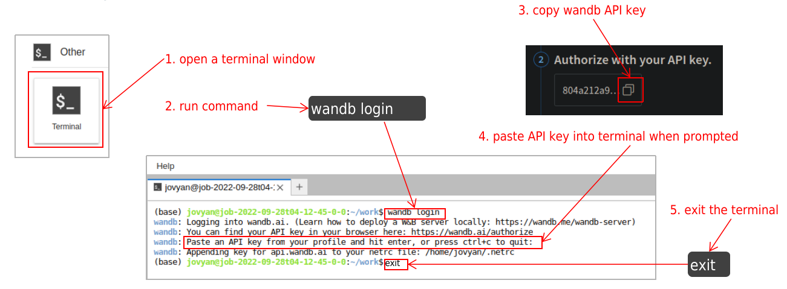  
  
confirm .netrc file was created*  
~~~bash
ls -a
~~~  
  
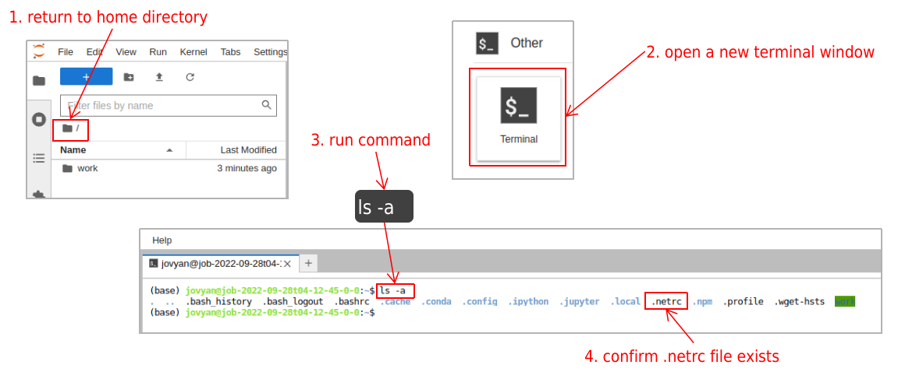  
  
*The jupyter lab UI does not show hidden files (files preceeded by a "."), which is why we must run the "list -a" command to see if the hidden .netrc file exists  
  
Copy the .netrc file to the persistent "wandb_creds" folder.  
~~~bash
cp .netrc work/wandb_creds/netrc
~~~  
(We will not put a period in front of the file name so that it will be visible to us)*
  
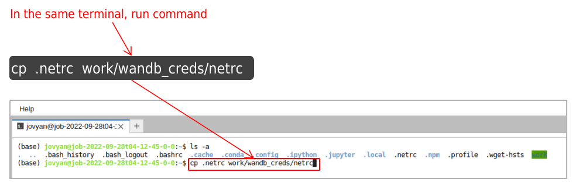  

*We copy it as a visible file (named “netrc” instead of “.netrc”) so that we do not mistake the wandb_creds folder for an empty folder, in the future.  
  
Confirm the copied files exists in our wandb_creds folder  
  
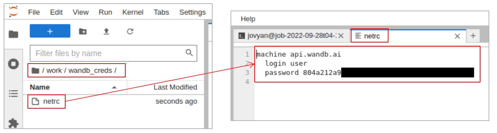  
  
Finally, we can delete the job  
  
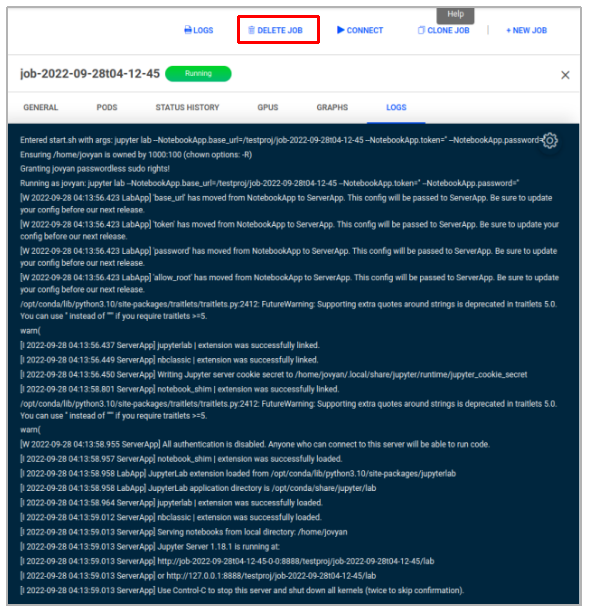  
  
## Running W&B with run:ai 
  
From now on, it is VERY important that we **mount the persistent netrc file** in our NFS, to the expected location of the **netrc file in our image**  
in our case, the persistent netrc file is at:  
**/home/jonathan_cosme/jcosme/wandb_creds/netrc**  
and it should be mounted to:  
**/home/jovyan/.netrc**  
  
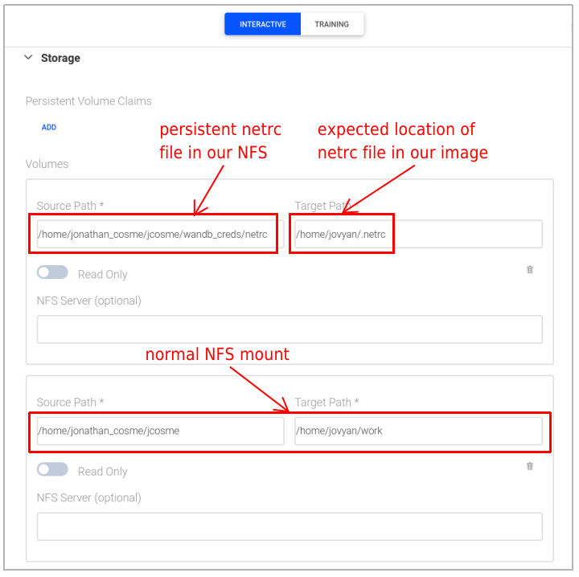  
  
Use the jonathancosme/base-root-wandb-tf image, and mount our NFS directory to the work directory as usual  
  
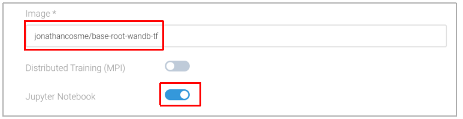  
  
### Jupyter example  
  
within our directory:  
/home/jovyan/work/projects/wandb_demo  
we have a **wandb_demo.ipynb** notebook.  
  
Within the notebook, we create a wandb project called **wandb-notebook**  
  
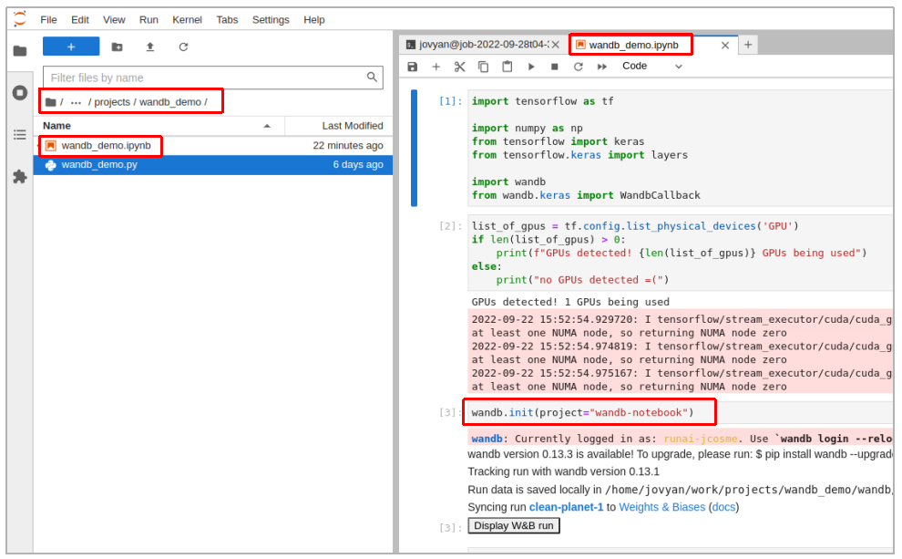  
  
If we run the wandb_demo.ipynb notebook, we will see the updates on our wandb.ai account  
  
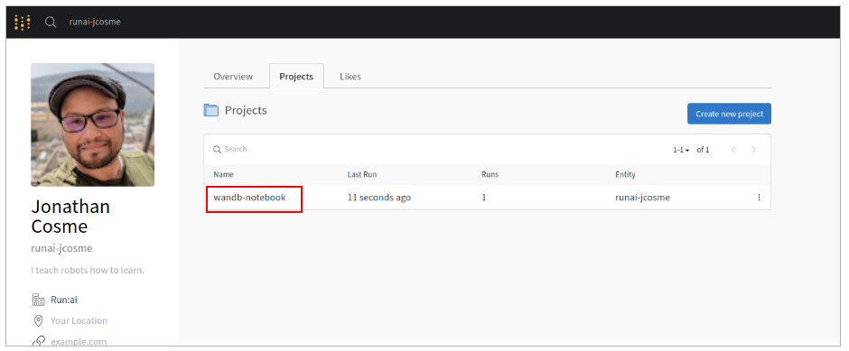  
  
### CLI example
  
within our directory:  
/home/jovyan/work/projects/wandb_demo  
we also have a **wandb_demo.py** python script.  

Within the script, we create a wandb project called **wandb-script**  
  
  
  
we can run wandb_demo.py via the CLI with this command  
~~~bash
runai submit \
	--project testproj \
	--gpu 1 \
	--job-name-prefix wandb-demo \
	--image jonathancosme/base-root-wandb-tf \
	--volume /home/jonathan_cosme/jcosme:/home/jovyan/work \
	--volume /home/jonathan_cosme/jcosme/wandb_creds/netrc:/home/jovyan/.netrc \
	-- conda run -n base python work/projects/wandb_demo/wandb_demo.py
~~~  
  
here are the key highlights  
  
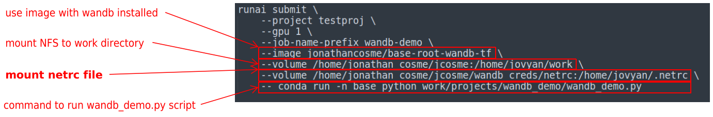  
  
After submitting the CLI command, we will see the updates on our wandb.ai account  
  
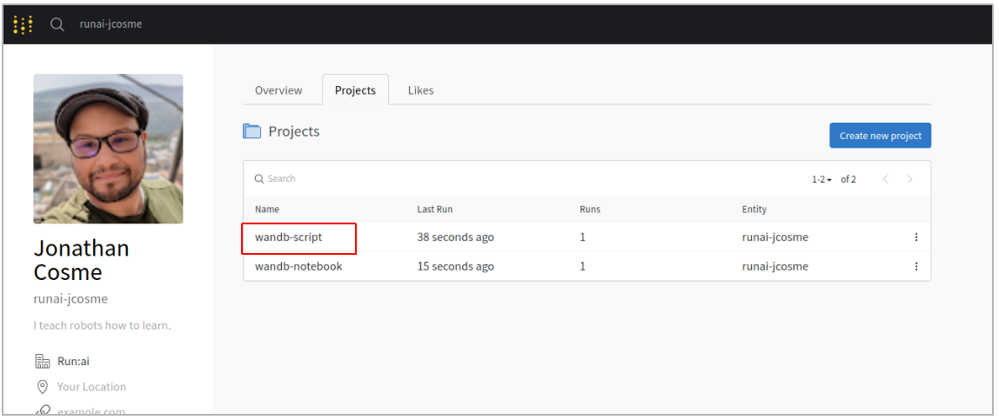  

## Thank you!
[info@run.ai](mailto:info@run.ai) | [run.ai](https://run.ai)  
  
[contact@wandb.ai](mailto:contact@wandb.ai) | [wandb.ai](https://wandb.ai)  
  

